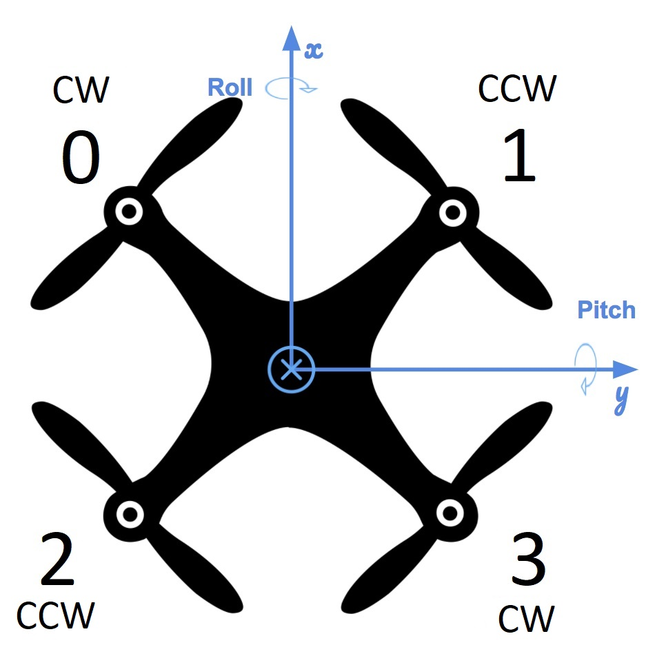
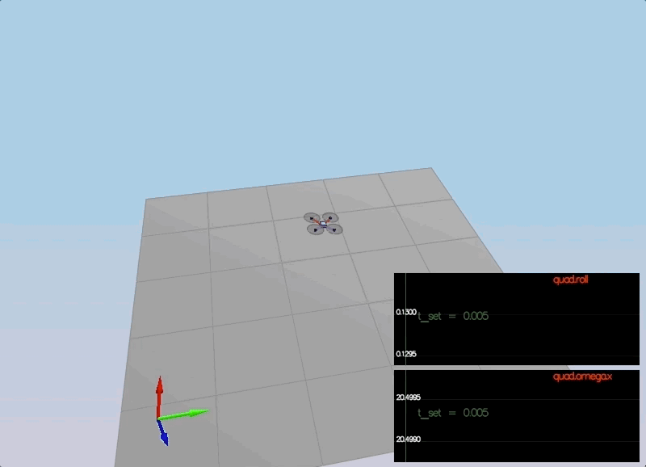
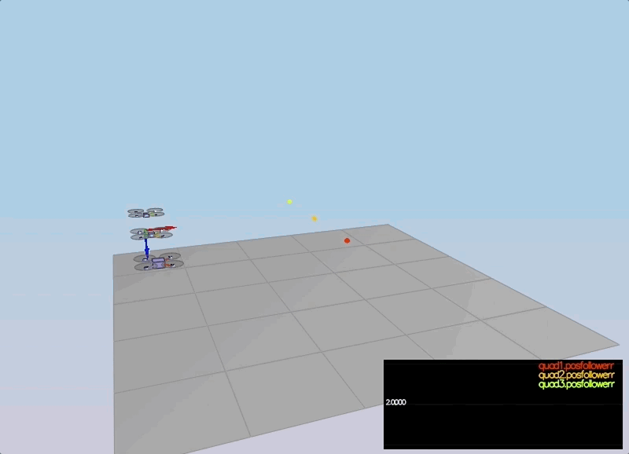

# Controller Project
This is my write up for the C++ controller project  consisting of C++ implementation and test case results.
# Controller implementation
#### `QuadControl::AltitudeControl`
A cascaded P controller with an integrator and a feedforward term is used to command altitude. The scalar thrust command $F= mc$ is then returned with $c$ being the acceleration command:
$$
\ddot{z}_c = K_I\int_0^{dt}(z_c - z) + \ddot{z}_{ff} + K_v(K_p(z_c - z + \dot{z}_c) - \dot{z}) \\
c = (g - \ddot{z}) / b_z
$$
```c++
float QuadControl::AltitudeControl(float posZCmd, float velZCmd,
        float posZ, float velZ, Quaternion<float> attitude,
        float accelZCmd, float dt) {
    Mat3x3F R = attitude.RotationMatrix_IwrtB();
    float thrust = 0;
    integratedAltitudeError += (posZCmd - posZ) * dt;
    float posZDotCmd = kpPosZ * (posZCmd - posZ) + velZCmd;
    posZDotCmd = CONSTRAIN(
        posZDotCmd, -maxAscentRate, maxDescentRate);
    float u1Bar = KiPosZ * integratedAltitudeError +
        accelZCmd + kpVelZ * (posZDotCmd - velZ);
    thrust = -mass * (u1Bar - float(CONST_GRAVITY)) / R(2, 2);
    return thrust;
}
```
#### `QuadControl::LateralPositionControl`
A cascaded P controller with a feedforward term is used to command lateral position $x, y$:
$$
\ddot{x}_c = \ddot{x}_{ff} + K_v(K_p(x_c - x + \dot{x}_c) - \dot{x}) \\
\ddot{y}_c = \ddot{y}_{ff} + K_v(K_p(y_c - y + \dot{y}_c) - \dot{y})
$$
```c++
V3F QuadControl::LateralPositionControl(V3F posCmd, V3F velCmd,
        V3F pos, V3F vel, V3F accelCmdFF) {
    accelCmdFF.z = 0;
    velCmd.z = 0;
    posCmd.z = pos.z;
    V3F accelCmd = accelCmdFF;
    V3F posDotCmd = kpPosXY * (posCmd - pos) + velCmd;
    // Limit the horizontal speed within the threshold
    if (posDotCmd.magXY() > maxSpeedXY) {
        posDotCmd *= maxSpeedXY / posDotCmd.magXY();
    }    
    accelCmd += kpVelXY * (posDotCmd - vel);
    // Limit the horizontal accelaration within the threshold
    if (accelCmd.magXY() > maxAccelXY) {
        accelCmd *= maxAccelXY / accelCmd.magXY();
    }
    accelCmd.z = 0;
    return accelCmd;
}
```
#### `QuadControl::RollPitchControl`
A P controller is used to command roll/pitch rates $b^x/b^y$, $R_{02}/R_{12}$ in the rotation matrix $^IR^B$, which are derived from lateral position commands $\ddot{x}_c, \ddot{y}_c$ and thrust acceleration scalar $c$. Body rate commands $p_c, q_c$ are then obtained.
$$
\begin{pmatrix} b^x_c \\ b^y_c \\ \end{pmatrix} = \frac{1}{c} \begin{pmatrix} \ddot{x}_c\\ \ddot{y}_c\\ \end{pmatrix} \\
\dot{b}^x_c  = K_p(b^x_c - b^x) \\
\dot{b}^y_c  = K_p(b^y_c - b^y) \\
\begin{pmatrix} p_c \\ q_c \\ \end{pmatrix}  = \frac{1}{R_{22}}\begin{pmatrix} R_{10} & -R_{00} \\ R_{11} & -R_{01} \end{pmatrix} \begin{pmatrix} \dot{b}^x_c \\ \dot{b}^y_c  \end{pmatrix}
$$
```c++
V3F QuadControl::RollPitchControl(V3F accelCmd,
        Quaternion<float> attitude, float collThrustCmd) {
    V3F pqrCmd;
    Mat3x3F R = attitude.RotationMatrix_IwrtB();
    if (collThrustCmd == 0) return pqrCmd;
    float c = -collThrustCmd / mass;
    V3F bXYCmd = accelCmd / c;
    // Constrain b_x and b_y with max tilt angle
    bXYCmd.x = CONSTRAIN(bXYCmd.x, -maxTiltAngle, maxTiltAngle);
    bXYCmd.y = CONSTRAIN(bXYCmd.y, -maxTiltAngle, maxTiltAngle);
    float bDotXCmd = kpBank * (bXYCmd.x - R(0, 2));
    float bDotYCmd = kpBank * (bXYCmd.y - R(1, 2));
    pqrCmd[0] = 1.f / R(2, 2) *
        (R(1, 0) * bDotXCmd - R(0, 0) * bDotYCmd);
    pqrCmd[1] = 1.f / R(2, 2) *
        (R(1, 1) * bDotXCmd - R(0, 1) * bDotYCmd);
    pqrCmd[2] = 0.f;
    return pqrCmd;
}
```
#### `QuadControl::YawControl`
A P controller is used to command yaw rate $\psi$:
$$
\dot{\psi} = \dot{r}_c = K_p (\psi_c - \psi_a)
$$
Some truncation is then done to find `yawError` in $[-\pi, \pi]$.
```c++
float QuadControl::YawControl(float yawCmd, float yaw) {
    float yawRateCmd = 0;
    float PI = (float)M_PI;
    yawCmd = fmodf(yawCmd, 2 * PI);
    float yawError = yawCmd - yaw;
    if (yawError <= -PI) {
        yawError += 2 * PI;
    }
    else if (yawError > PI) {
        yawError -= 2 * PI;
    }
    yawRateCmd = kpYaw * yawError;
    return yawRateCmd;
}
```
#### `QuadControl::BodyRateControl`
A P controller is used to command body rates $p, q, r$ . Moment commands $M_c$ given by moments of inertia and body acceleration rates then returned.
$$
\dot{p}_c = K_{p-p}(p_c - p) \\
\dot{q}_c = K_{p-q}(q_c - q) \\
\dot{r}_c = K_{p-r}(p_c - r) \\
\begin{pmatrix} M_{c, x} \\ M_{c, y} \\ M_{c, z} \end{pmatrix} = \begin{pmatrix} I_{xx} & 0 & 0 \\  0 & I_{yy} & 0 \\ 0 & 0 & I_{zz} \end{pmatrix} \begin{pmatrix} \dot{p}_c \\ \dot{q}_c \\ \dot{r}_c \end{pmatrix}
$$
```c++
V3F QuadControl::BodyRateControl(V3F pqrCmd, V3F pqr) {
    V3F momentCmd;
    V3F pqrDotCmd = kpPQR * (pqrCmd - pqr);
    momentCmd.x = Ixx * pqrDotCmd.x;
    momentCmd.y = Iyy * pqrDotCmd.y;
    momentCmd.z = Izz * pqrDotCmd.z;
    return momentCmd;
}
```
#### `QuadControl::GenerateMotorCommands`
<p align=center>

</p>

Courtesy of *Mike Hahn*, the figure above shows the four motors of the drone in NED(XYZ) coordinates.
- front left rotating CW, yields reactive moment $\kappa F_0$ in $-z$ direction
- front right rotating CCW, yields reactive moment $\kappa F_1$ in $+z$ direction
- rear left rotating CCW, yields reactive moment $\kappa F_2$ in $+z$ direction
- rear right rotating CW, yields reactive moment $\kappa F_3$ in $-z$ direction

Define $l$ as the perpendicular distance from $x, y$ axis to each motor. Individual motor commands $F_i$ are computed by solving the matrix below given $c$ as the scalar total thrust acceleration command and moment commands $M_c$.
$$
\begin{pmatrix} 1 & 1 & 1 & 1 \\ l & -l & l & -l \\ l & l & -l & -l\\ -\kappa & \kappa & \kappa & -\kappa \end{pmatrix} \times \begin{pmatrix} F_0 \\ F_1 \\ F_2\\ F_3 \end{pmatrix} = \begin{pmatrix} mc \\ M_{c,x} \\ M_{c,y} \\ M_{c,z} \end{pmatrix}
$$
```c++
VehicleCommand QuadControl::GenerateMotorCommands(
        float collThrustCmd, V3F momentCmd) {
    float l = L / sqrt(2);
    float c_bar = collThrustCmd;
    float p_bar = momentCmd.x / l;
    float q_bar = momentCmd.y / l;
    float r_bar = momentCmd.z / kappa;
    float omega1Sq = c_bar + p_bar + q_bar - r_bar; //F0
    float omega2Sq = c_bar - p_bar + q_bar + r_bar; //F1
    float omega3Sq = c_bar + p_bar - q_bar + r_bar; //F2
    float omega4Sq = c_bar - p_bar - q_bar - r_bar; //F3
    cmd.desiredThrustsN[0] = omega1Sq * 0.25; // front left
    cmd.desiredThrustsN[1] = omega2Sq * 0.25; // front right
    cmd.desiredThrustsN[2] = omega3Sq * 0.25; // rear left
    cmd.desiredThrustsN[3] = omega4Sq * 0.25; // rear right
    return cmd;
}
```
# Results
The results for the case scenarios are shown below.
## Scenario 2
<p align=center>

</p>
## Scenario 3
<p align=center>

</p>
## Scenario 4
<p align=center>

</p>
## Scenario 5
### Extra Challenge 1
Q1: Inspect the python script `traj/MakePeriodicTrajectory.py`.  Can you figure out a way to generate a trajectory that has velocity (not just position) information?

A1: This can be done via finite differencing positions.
```python
if t == 0:
    the_file.write("," + fmt(0) + "," + fmt(0) + "," + fmt(0))
else:
    the_file.write(
        "," + fmt((x - px) / timestep) + \
        "," + fmt((y - py) / timestep) + \
        "," + fmt((z - pz) / timestep)
    )
px, py, pz = x, y, z
```

Q2: Generate a new `FigureEightFF.txt` that has velocity terms.
Did the velocity-specified trajectory make a difference? Why?

A2: It does because it adds feed forward terms to the controller. The figure below shows the trajectories of the two drones, one in red without any velocity information and other in yellow with velocity terms. The position error over time for yellow is much smaller than that for red.

<p align=center>

</p>
### Extra Challenge 2

Q1: For flying a trajectory, is there a way to provide even more information for even better tracking?

If the trajectory $x$ is known, the velocity $\dot{x}$ can be computed by finite differencing. Likewise, if we can derive acceleration $\ddot{x}$, jerk $\dddot{x}$ and even snap $\ddddot{x}$ and minimize them...

Q2: How about trying to fly this trajectory as quickly as possible (but within following threshold)!
